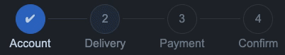

# vue-mzc-steps
Simple Vue2 steps component



[Online demo](https://codesandbox.io/s/angry-morse-byc4p?file=/src/App.vue)

## Installation
```sh
npm install vue-mzc-steps --save
```

## Usage
```js
import VueMzcSteps from "vue-mzc-steps";
import "vue-mzc-steps/src/vue-mzc-steps.css";

export default {
  components: {
    VueMzcSteps,
  },
  data() {
    return {
      step: 1, // current step
      steps: [
        { id: 1, title: "Account" },
        { id: 2, title: "Delivery" },
        { id: 3, title: "Payment" },
        { id: 4, title: "Confirm" },
      ],
    };
  },
};
```
```html
<vue-mzc-steps :items="steps" :step="step" />
```